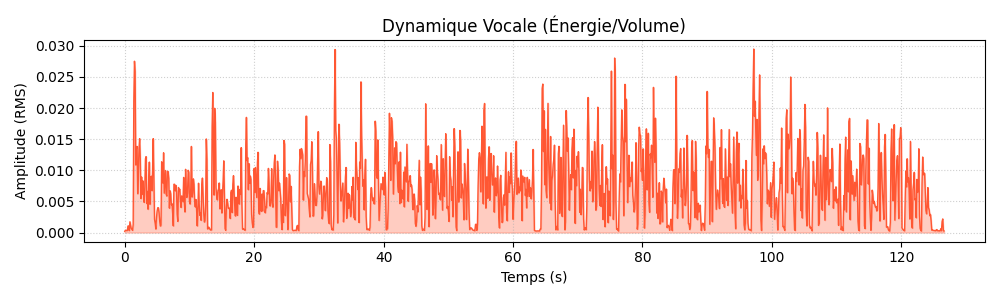
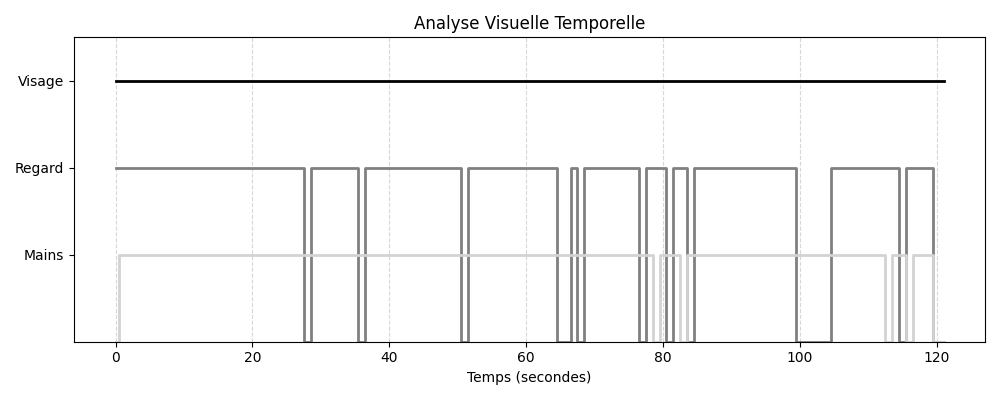

# Rapport SpeechCoach : Test5

**Langue détectée** : EN
**Durée** : 121.75 secondes
**Résolution** : 1280x720 @ 16.58 fps
**Temps de traitement** : 5m 37s (337.2s) (x2.77 RTF)

## Métriques Vocales (Audio)
- **Débit (WPM)** : 143.3 mots/min (Bon rythme)
- **Pauses (>0.5s)** : 6 pauses
- **Hésitations (Fillers)** : 2 détectées

### Dynamique Vocale

### Qualité & Environnement (Sprint 3)
- **Luminosité** : 145.1/255 (OK ✅)
- **Netteté (Blur Score)** : 12 (Flou 🌫️)

### Métriques Visuelles (Vision)
- **Présence Visage** : 100% du temps (OK)
- **Contact Visuel (Regard Caméra)** : 86% (Bonne connexion)
- **Mains Visibles** : 94% du temps (OK)
- **Intensité Gestuelle** : 3.3/10 (Naturel)

### Timeline Visuelle

## Transcription

- **[0.0s - 6.9s]** : Hello everyone, my name is Hisha Moussaid, I am 24 years old, I was originally born in
- **[6.9s - 11.1s]** : Az-Zilal, but 7 years ago, maybe 8 years ago, we moved here to Beni Millal so I could
- **[11.1s - 17.9s]** : continue my studies. Currently I am a master's student in intelligence systems for education.
- **[17.9s - 22.2s]** : I am passionate about technology, artificial intelligence and how digital tools can be
- **[22.2s - 28.8s]** : used to improve and learn better. Before my master's degree, I have studied computer
- **[28.8s - 33.6s]** : science and information systems. During my studies, I have worked on multiple academic
- **[33.6s - 40.4s]** : projects related to web development, programming and also AI. I was also able to land an
- **[40.4s - 46.4s]** : internship in a company here in Beni Millal called GMsoft. This helped me a lot to improve
- **[46.4s - 54.3s]** : my communication, technical skills, also my teamwork skills. Currently or right now
- **[54.3s - 59.5s]** : I am working on a project called Speech Coach. It is an AI application that analyses a person
- **[59.5s - 65.4s]** : speaking in a video. What it does basically is it takes a video, it extracts both
- **[65.4s - 71.2s]** : audio and images, we call them also frames, then the system studies voice metrics like
- **[71.2s - 77.3s]** : for example speaking speed, the number of pauses, hesitations etc. Not only that,
- **[77.3s - 84.3s]** : it also studies visual aspects like for example face presence, eye contact, hand
- **[84.3s - 90.0s]** : gestures etc. The goal is to help students and speakers to improve their communication
- **[90.0s - 96.9s]** : skills using automatic feedback. I really enjoy combining artificial intelligence and
- **[96.9s - 104.3s]** : education because I believe that technology should be used to help and support teachers
- **[104.6s - 109.8s]** : and learners and not replace them. Of course in the future I hope to become an educator
- **[109.8s - 116.8s]** : who uses these digital tools to give AI better interactive and effective learning experiences.
