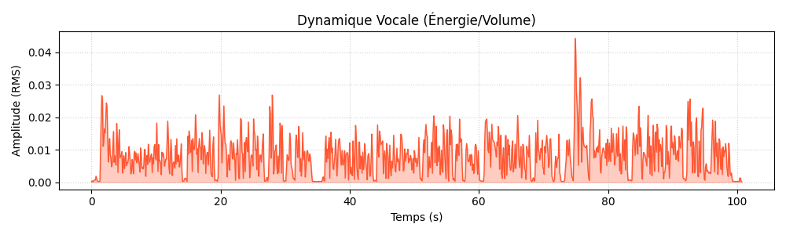
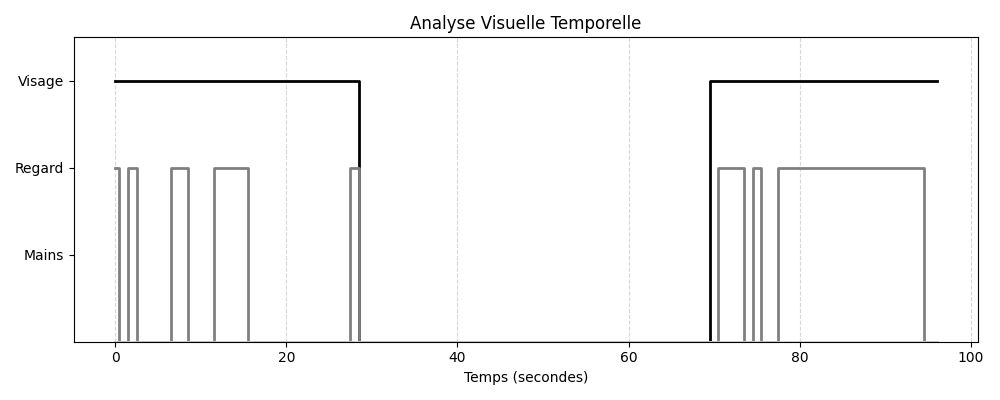

# Rapport SpeechCoach : Test6

**Langue détectée** : EN
**Durée** : 96.88 secondes
**Résolution** : 1280x720 @ 16.58 fps
**Temps de traitement** : 3m 33s (213.3s) (x2.20 RTF)

## Métriques Vocales (Audio)
- **Débit (WPM)** : 120.6 mots/min (Bon rythme)
- **Pauses (>0.5s)** : 11 pauses
- **Hésitations (Fillers)** : 2 détectées

### Dynamique Vocale

### Qualité & Environnement (Sprint 3)
- **Luminosité** : 125.7/255 (OK ✅)
- **Netteté (Blur Score)** : 9 (Flou 🌫️)

### Métriques Visuelles (Vision)
- **Présence Visage** : 58% du temps 
- **Contact Visuel (Regard Caméra)** : 54% (Moyen)
- **Mains Visibles** : 0% du temps (Corps figé ?)
- **Intensité Gestuelle** : 0/10 (Statique)

### Timeline Visuelle

## Transcription

- **[0.0s - 8.0s]** : Hello everyone, my name is Hisham Wissahid. I am currently a master's student in intelligence systems for education at UNS McNeese.
- **[8.0s - 14.0s]** : I am passionate about technology, artificial intelligence, and how digital tools can help people learn better.
- **[14.0s - 19.0s]** : Before this master's degree, I studied computer science and information systems.
- **[19.0s - 26.0s]** : During my studies, I worked on several academic projects related to programming, web development, and AI.
- **[26.0s - 42.0s]** : I also completed an internship where I contributed to building educational platforms, which helped me improve my technical and teamwork skills.
- **[42.0s - 50.0s]** : Right now, I am working on a project called Speech Coach. It is an AI application that analyzes a person's speaking in a video.
- **[50.0s - 57.0s]** : The system studies voice metrics like speaking speed, pauses, and hesitation words.
- **[57.0s - 63.0s]** : It also analyzes visual aspects like face presence and eye contact.
- **[63.0s - 70.0s]** : The goal is to help students and presenters improve their communication skills using automatic feedback.
- **[71.0s - 83.0s]** : I really enjoy combining artificial intelligence with education because I believe technology should support teachers and learners, not replace them.
- **[83.0s - 95.0s]** : In the future, I hope, of course, to become an educator who uses these tools to create a more interactive and effective learning experience.
