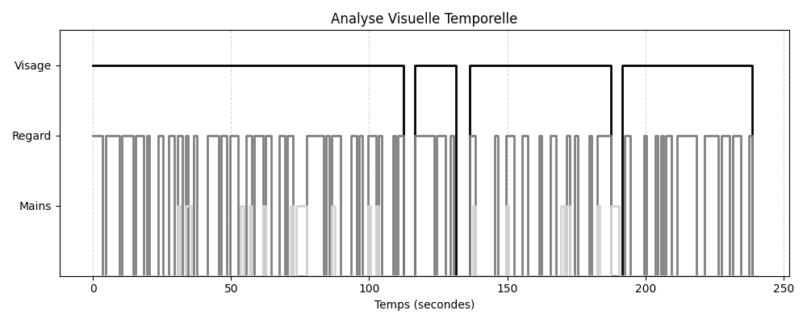

# Rapport SpeechCoach : test2

**Langue détectée** : EN
**Durée** : 241.23 secondes
**Résolution** : 640x360 @ 30.00 fps
**Temps de traitement** : 9m 57s (597.3s) (x2.48 RTF)

## Métriques Vocales (Audio)
- **Débit (WPM)** : 194.4 mots/min (Rapide)
- **Pauses (>0.5s)** : 13 pauses
- **Hésitations (Fillers)** : 5 détectées

### Dynamique Vocale

### Qualité & Environnement (Sprint 3)
- **Luminosité** : 99.5/255 (OK ✅)
- **Netteté (Blur Score)** : 383 (Net 📷)

### Métriques Visuelles (Vision)
- **Présence Visage** : 94% du temps (OK)
- **Contact Visuel (Regard Caméra)** : 54% (Moyen)
- **Mains Visibles** : 9% du temps (Corps figé ?)
- **Intensité Gestuelle** : 2.8/10 (Naturel)

### Timeline Visuelle

## Transcription

- **[0.0s - 4.0s]** : Hi everybody, welcome back. Today I'm going to talk to you about something really important
- **[4.0s - 8.7s]** : for entrepreneurs, small business people, and creative professionals, and that is presentation
- **[8.7s - 13.3s]** : skills. This is actually a request video from one of my viewers, Rahil Anwar, who
- **[13.3s - 18.0s]** : asked how can he improve his presentation skills. The first thing you need to know
- **[18.0s - 22.2s]** : is that presenting in public or speaking in public is scary, so if you are afraid
- **[22.2s - 26.0s]** : of public speaking, you are not alone. In fact, 25% of people in the world
- **[26.0s - 30.7s]** : rank public speaking as the number one fear that they have. This runs first,
- **[30.7s - 36.9s]** : followed by heights, followed by bugs and snakes. So speaking in public is
- **[36.9s - 41.2s]** : scary to a lot of people. If you're a designer or creative professional, you
- **[41.2s - 44.4s]** : are called upon regularly to present your work, so you have to stand up
- **[44.4s - 48.1s]** : in front of either clients or your peers and talk about what it is that
- **[48.1s - 51.9s]** : you've produced. Entrepreneurs and small business people regularly have to
- **[51.9s - 56.3s]** : pitch new business to groups of people, have to speak in public at
- **[56.3s - 61.0s]** : conferences, or they have to pitch new investors to get investment in
- **[61.0s - 64.7s]** : their business. So as I talk about improving your presentation skills, I'm
- **[64.7s - 68.3s]** : going to break it into three buckets. Prep, what you do in the room,
- **[68.3s - 72.5s]** : and what you do afterwards. So let's talk about prep a little bit. One of
- **[72.5s - 75.0s]** : the things you can do to improve your skills is you can watch the
- **[75.0s - 79.6s]** : greats. Ted has some amazing videos from some of the best speakers in the
- **[79.6s - 83.9s]** : world, and I encourage you to look at as many TED Talks as you can and really
- **[83.9s - 88.5s]** : kind of deconstruct what people do. How do they start off their talk? How do
- **[88.5s - 92.1s]** : they engage the audience? How do they tell a story? How do they walk? How
- **[92.1s - 96.7s]** : do they move? How do they present the slides that are behind them? What's
- **[96.7s - 100.4s]** : the cadence of their speech? Do they tell jokes? Are they serious? Are they
- **[100.4s - 105.5s]** : quiet? Are they loud? Deconstruct how different people present. You can learn
- **[105.6s - 111.8s]** : a lot from that. Also, prep, preparing for your speech or how you present, is
- **[111.8s - 116.0s]** : the most important thing. So knowing your material. You need to know your
- **[116.0s - 120.1s]** : material cold. You need to read through it a million times. Write
- **[120.1s - 124.6s]** : speaker notes and read through them. Internalize it. You want to practice
- **[124.6s - 128.4s]** : it. You want to run through it over and over. One thing that you can do
- **[128.4s - 132.0s]** : that's really helpful is to watch yourself. You can either watch yourself
- **[132.0s - 136.6s]** : in a mirror, which is tough to do because as you're speaking and also
- **[136.6s - 139.9s]** : looking at yourself, it can be very disconcerting. So actually speaking to
- **[139.9s - 142.6s]** : a mirror is one of those things that's very helpful in learning
- **[142.6s - 146.0s]** : presentation skills. The other thing you can do is to audio tape yourself
- **[146.0s - 149.5s]** : or video tape yourself. I suggest video. Everyone's got a smartphone in
- **[149.5s - 153.4s]** : their pocket, so they can video tape themselves very easily. You will
- **[153.4s - 158.3s]** : notice your habits of speech, whether you say um or ah or, you know, have
- **[158.3s - 161.1s]** : long pauses or whether you're rushing your speech or whether you're
- **[161.1s - 164.9s]** : pacing too much or whether you're using the hands too much. Those things
- **[164.9s - 168.9s]** : will become really apparent to you as you present and practice and run
- **[168.9s - 174.0s]** : through your talk or your speech. And when you watch those things, try
- **[174.0s - 177.1s]** : to make note of the things that you want to improve. Next time you
- **[177.1s - 181.2s]** : video yourself, try to be a little better at it. Try to watch your um's
- **[181.2s - 185.4s]** : and ah's or how you're moving your hands. Do it over and over and
- **[185.4s - 190.8s]** : try to refine your comfort with how you present. And also because
- **[190.8s - 195.3s]** : you're watching yourself, it's really easy to lose perspective. So you
- **[195.3s - 199.2s]** : are watching yourself and you can't distance yourself from seeing
- **[199.2s - 202.6s]** : what other people might be able to see. So it's also important to
- **[202.6s - 206.8s]** : get feedback or invite constructive criticism from other people.
- **[206.8s - 210.3s]** : Get them to watch the video or better yet, present to other people,
- **[210.3s - 214.0s]** : your wife, your girlfriend, your significant other, and ask them
- **[214.0s - 218.4s]** : to give you constructive feedback and not hold back around what
- **[218.5s - 221.4s]** : it is that you're doing that's great and what it is that you're doing
- **[221.4s - 225.7s]** : that may not be so great. So let's talk about the second bucket of
- **[225.7s - 228.6s]** : presentation skills. And that's what you do when you're in the
- **[228.6s - 232.1s]** : room. The first thing you do is when you get to the room, you
- **[232.1s - 236.3s]** : show up to the room early so you can have a moment to collect
- **[236.3s - 239.8s]** : your thoughts, to breathe. So you're not feeling rushed going
- **[239.8s - 241.1s]** : into your presentation.
